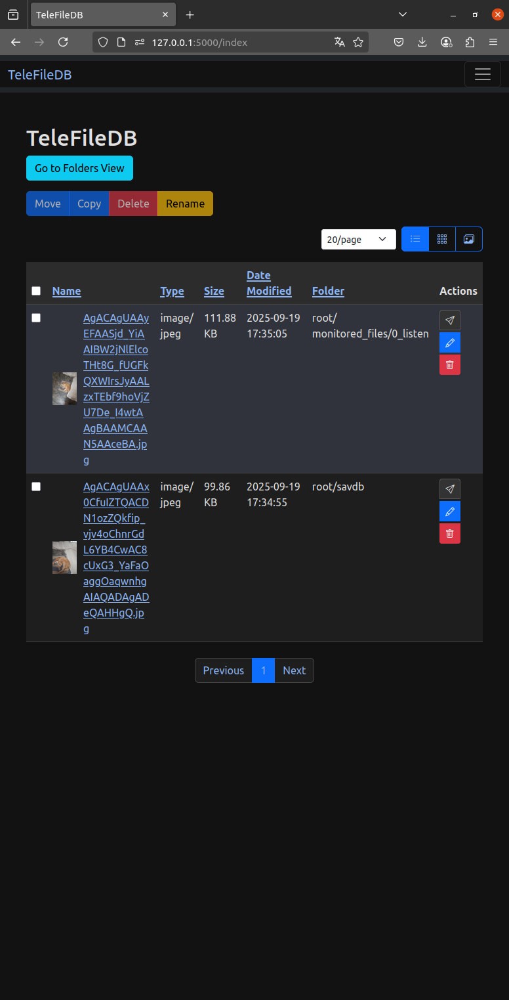
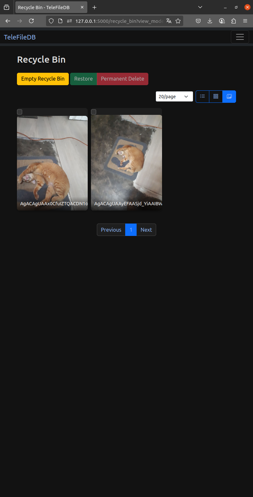
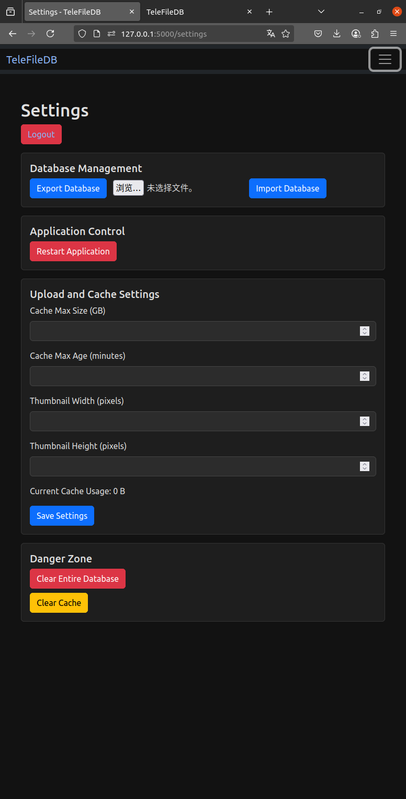
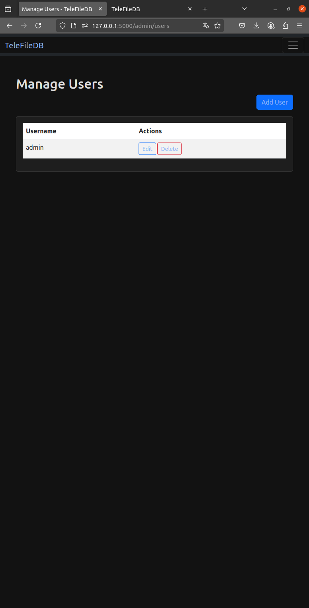

[English](./README.md) | [中文](./README.zh-CN.md)

# TeleFileDB - Telegram Favorites Organizer and Search Engine

This project was created from scratch by me, with no prior coding experience, using natural language with the Gemini CLI.
"Parts of the code in this project were generated by an AI tool (Gemini CLI). If there are any licensing disputes, please contact me for correction."

TeleFileDB is a tool designed specifically for organizing and searching files saved in Telegram. It transforms a Telegram channel or group into a high-speed, searchable, and manageable personal file index, freeing you from cluttered conversations and making it easy to find every important file.

## Core Concept

The core of this project is not a traditional cloud storage service, but an **Indexer** and a **Search Engine**.

-   **Primary Method of Adding Files**: The `run_listener.py` script runs in the background to automatically listen for new files in specified groups, or you can manually save files from any group using commands, storing their information in the database.
-   **Primary Use Case**: Use the modern web interface to perform high-speed searches, previews, create folders, and rename indexed files.
-   **Primary Method of Downloading**: Generate a `t.me` link through the web interface to jump to the official Telegram client for stable, high-speed downloads.

## License

This project is licensed under the MIT License. For details, please see the [LICENSE](LICENSE) file.

## Preview

<details>










</details>
---

## First Time Setup

Before deploying and running this project, you need to obtain some necessary keys and IDs from Telegram. Please follow the steps below.

### Step 1: Obtain Telegram API Keys

You need a personal `API_ID` and `API_HASH` to allow the Pyrogram client (`run_listener.py`) to operate on your behalf.

1.  Log in to [my.telegram.org](https://my.telegram.org) with your phone number.
2.  Click on **"API development tools"**.
3.  You will see a "Create new application" form. Fill in the `App title` and `Short name` arbitrarily (e.g., TeleFileDB), other fields can be left blank.
4.  Click "Create application".
5.  After completion, you will see your **`api_id`** and **`api_hash`** on the new page. Please copy them for later use.

### Step 2: Create a Telegram Bot

You need a bot to interact with this project, for example, to receive the `/savdb` command.

1.  In Telegram, search for **`@BotFather`** and start a conversation with him.
2.  Send the `/newbot` command.
3.  Follow the prompts to set a name and a unique username for your bot. The username must end in `bot`.
4.  After successful creation, `@BotFather` will give you a long **Token**. This is your `TELEGRAM_BOT_TOKEN`. Please copy it.
    > **Note:** This token is very important, please do not disclose it to anyone!

### Step 3: Set Bot Commands (Optional but Recommended)

To make it easier to use the `/savdb` command in Telegram, you can pre-set the command list for your bot.

1.  Go back to the conversation with `@BotFather`.
2.  Send the `/mybots` command, then select the bot you just created.
3.  Click **"Edit Bot"** -> **"Edit Commands"**.
4.  `@BotFather` will ask you to send the command list. Please copy and send the following **entire text**:
    ```
    savdb - [parameters] index files to the database
    ```
5.  After sending successfully, when you type `/` in any chat box, Telegram will automatically suggest the `savdb` command and its description.

### Step 4: Obtain Chat ID

You need to tell the project which groups/channels to listen to, or which private channel you want to save files to.

1.  **For public channels**, the ID is their username, e.g., `@my_channel`.
2.  **For private groups or channels**, the ID is a number starting with `-100`. Here's how to get it:
    -   **Method 1 (Recommended)**: **Temporarily add** your bot to the target group or channel and give it admin permissions. Then send any message in the group, and then visit `https://api.telegram.org/bot<YOUR_BOT_TOKEN>/getUpdates` (replace `<YOUR_BOT_TOKEN>` with the token you got in Step 2). You will find the `chat` object in the returned JSON data, and the `id` within it is the Chat ID you need.
    -   **Method 2**: Forward a message from the target group or channel to a bot like `@JsonDumpBot` or `@get_id_bot`, and they will return information containing the Chat ID.

### Step 5: Create the `.env` Configuration File

In the root directory of the project, create a file named `.env` and copy the following content into it. **Be sure to modify the file content according to the information you obtained in the previous steps and your own needs.**

```dotenv
# --- Telegram API (Required) ---
API_ID=1234567
API_HASH=your_api_hash
TELEGRAM_BOT_TOKEN=bot_token_here
TELEGRAM_CHAT_ID=-1001234567890

# --- Admin Account (Required) ---
ADMIN_USERNAME=admin
ADMIN_PASSWORD=your_secure_password

# --- Auto-monitoring Settings (Optional) ---
# Channel/group IDs to monitor in the background, separated by commas
# e.g.: MONITORED_CHAT_ID=-100123...1,-100456...2
MONITORED_CHAT_ID=

# (Not recommended, I have never successfully used other databases. But gemini cli wrote it, and it is troublesome to remove)
# --- Database Settings (Choose one of three) ---
# Choose one of the following settings according to your database deployment method

# [Option A - Use the built-in database with Docker Compose].
# DB_HOST=db
# DB_USER=telefiledb_user
# DB_PASSWORD=your_strong_db_password
# DB_NAME=telefiledb


# [Option B - Use a local database]
# DB_HOST=127.0.0.1
# DB_USER=your_local_db_user
# DB_PASSWORD=your_local_db_password
# DB_NAME=your_local_db_name

# [Option C - Use a remote database]
# DB_HOST=your_remote_db_address.com
# DB_USER=your_remote_db_user
# DB_PASSWORD=your_remote_db_password
# DB_NAME=your_remote_db_name
```

### Step 6: Set the Database Host (`DB_HOST`)

This variable tells the application where to connect to the database. Please choose according to your situation:

-   **Case 1: Deploy with Docker Compose (Recommended)**
    -   In `docker-compose.yml`, a commented out `db` service has been prepared for you.
    -   If you plan to use it, set `DB_HOST=db` in the `.env` file.
    -   **Why `db`?** Because in Docker's internal network, `db` is the service name of the database container.
    -   At the same time, you need to uncomment all `DB_*` and `MYSQL_ROOT_PASSWORD` variables in `[Option A]` of the `.env` file and fill in your own password.

-   **Case 2: Manual installation, and the database is on the local machine**
    -   If you have installed the MySQL database on the same server where you are running this project.
    -   Please set `DB_HOST=127.0.0.1` in the `.env` file.
    -   At the same time, please uncomment the variables in `[Option B]` of the `.env` file and fill in the username, password, and database name of your local database.

-   **Case 3: Use an external remote database**
    -   If you use a cloud database service (such as AWS RDS) or another independent database server.
    -   Please set `DB_HOST` to the **IP address** or **domain name** of the database in the `.env` file.
    -   At the same time, please uncomment the variables in `[Option C]` of the `.env` file and fill in the corresponding credentials.

---

## Deployment and Execution

After completing the setup, you can choose to run the project with Docker (recommended) or manually.

### Deploy with Docker (Recommended)

1.  **Environment Requirements**: Docker, Docker Compose
2.  **Start Services**: In the project root directory, execute the following command:
    ```bash
    docker-compose up -d --build
    ```
3.  **Initialize the database (only for the first start, usually executed automatically on startup, manual execution is only required in case of failure)**:
    ```bash
    docker-compose exec app flask init-db
    docker-compose exec app flask create-admin
    ```
    > **Tip**: The application has a smart judgment mechanism, and it is safe to execute the above commands repeatedly without overwriting existing data.

4.  **Start Using**: Access `http://<your-server-ip>:5000` through your browser.
5.  **Daily Management**:
    -   View logs: `docker-compose logs -f app` or check the `*.log` files in the project.
    -   Stop services: `docker-compose down`

## Feature Details

-   **Automatic Indexing**:
    -   As long as `run_listener.py` is running and you have set `MONITORED_CHAT_ID`, new files sent to these groups will be automatically indexed, and the files will be in a folder named after their group name.

-   **Manual Indexing (`/savdb` command)**:
    -   In any group where your bot is present, reply to a message and use the `/savdb` command to manually index it.
    -   **Advanced Parameters**:
        -   `-m <folder_path>`: Specify the save path.
        -   `-n <new_filename>`: Rename.
        -   `-b`: Index the entire album.
        -   `-i <number>`: Continuously index N files.

-   **Web Interface Usage**:
    -   After logging in, you can perform operations such as searching, managing, and previewing.
    -   **Recommended Download Method**: After finding the file, click the "Open in Telegram" button to download using the official client.
