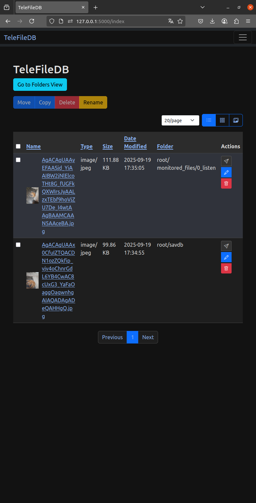
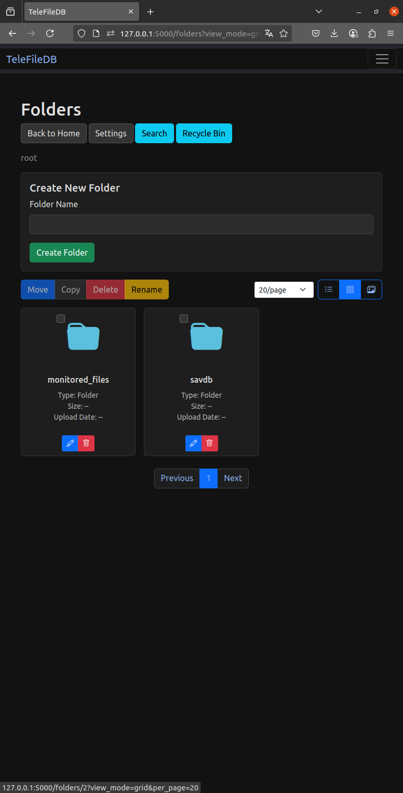
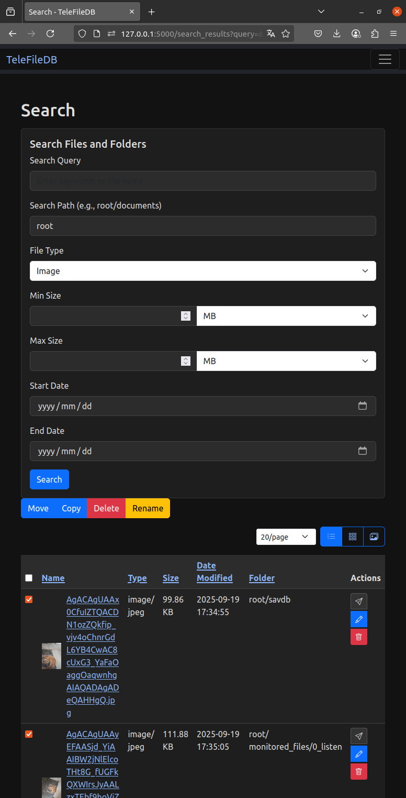
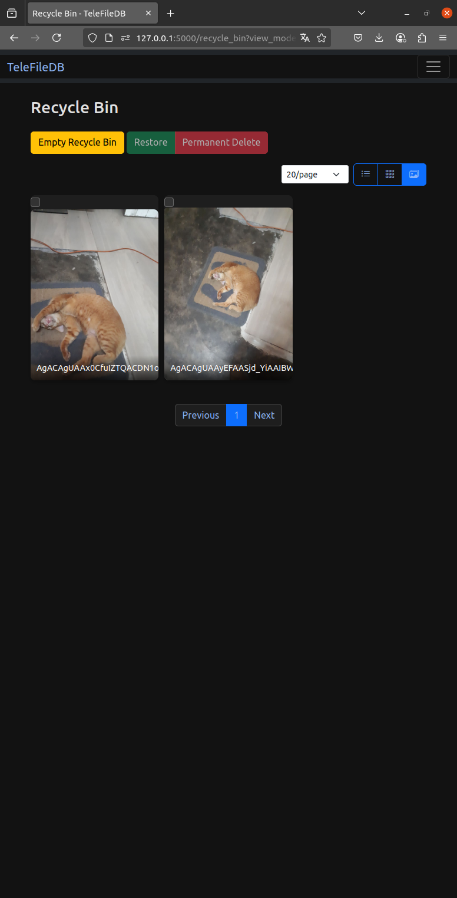
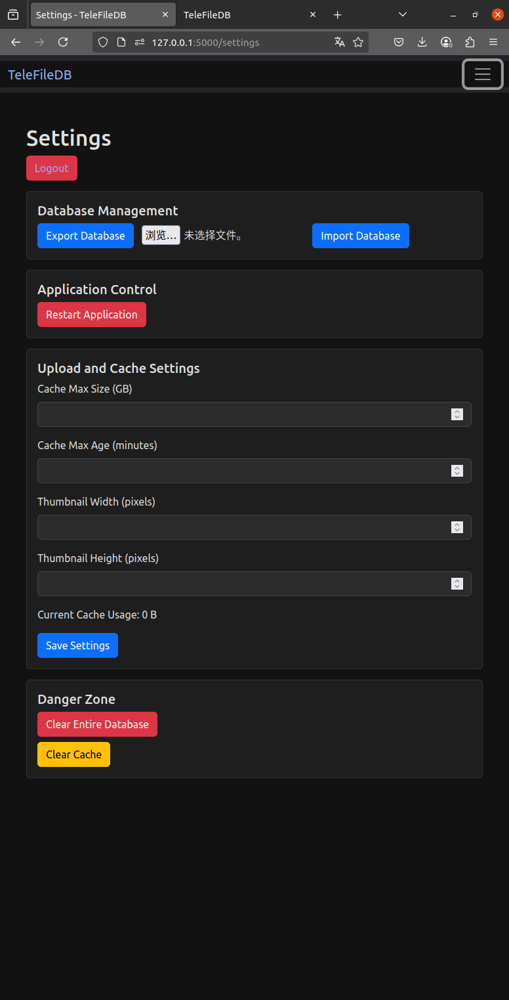
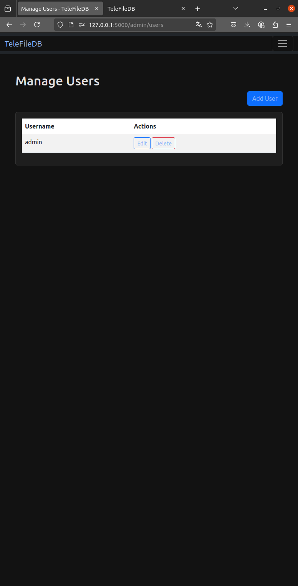

[English](./README.md) | [中文](./README.zh-CN.md)

# TeleFileDB - Telegram 收藏夾整理與搜尋引擎
這是本人零基礎,一點都不會寫代碼的情況下,用自然語言讓gemini cli做出來的.
「本專案部分程式碼由 AI 工具（Gemini CLI）生成。如有授權爭議，請聯繫我更正。」
TeleFileDB 是一個專為整理和搜尋在 Telegram 中收藏的檔案而設計的工具。它將 Telegram 頻道或群組變成一個可被高速搜尋、管理的個人檔案索引庫，從雜亂的對話中解放出來，輕鬆找到每一個重要檔案。

## 核心理念

本專案的核心並非一個傳統的網盤，而是一個**索引器 (Indexer)** 和**搜尋引擎 (Search Engine)**。

- **主要添加檔案方式**：透過 `run_listener.py` 腳本，在背景自動監聽指定群組的新檔案，或在任何群組中透過指令手動收藏檔案，將其資訊存入資料庫。
- **主要使用場景**：透過現代化的 Web 介面，對已索引的檔案進行高速搜尋、預覽、建立資料夾、重新命名等操作。
- **主要下載方式**：透過 Web 介面產生的 `t.me` 連結，一鍵跳轉到 Telegram 官方客戶端進行穩定、高速的下載。


## 版權與授權 (License)

本專案採用 MIT 授權協議。詳情請參閱 [LICENSE](LICENSE) 檔案。

## 預覽








---

## 首次設定教學 (First Time Setup)

在部署和執行本專案前，您需要先從 Telegram 獲取一些必要的金鑰和 ID。請依照以下步驟操作。

### 第一步：獲取 Telegram API 金鑰

您需要一組個人的 `API_ID` 和 `API_HASH` 來讓 Pyrogram 客戶端（`run_listener.py`）以您的名義運作。

1.  使用您的手機號碼登入 [my.telegram.org](https://my.telegram.org)。
2.  點擊 **"API development tools"**。
3.  您會看到一個 "Create new application" 的表單。隨意填寫 `App title` 和 `Short name` (例如：TeleFileDB)，其他欄位可以留空。
4.  點擊 "Create application"。
5.  完成後，您會在新頁面看到您的 **`api_id`** 和 **`api_hash`**。請將它們複製下來，稍後會用到。

### 第二步：建立 Telegram 機器人

您需要一個機器人 (Bot) 來與本專案互動，例如接收 `/savdb` 指令。

1.  在 Telegram 中，搜尋 **`@BotFather`** 並開始與他對話。
2.  發送 `/newbot` 指令。
3.  按照提示，為您的機器人設定一個暱稱 (Name) 和一個獨一無二的使用者名稱 (Username)，使用者名稱必須以 `bot` 結尾。
4.  建立成功後，`@BotFather` 會給您一長串的 **Token**。這就是您的 `TELEGRAM_BOT_TOKEN`。請將它複製下來。
    > **注意：** 這個 Token 非常重要，請絕對不要洩漏給任何人！

### 第三步：設定機器人指令 (可選但建議)

為了方便在 Telegram 中使用 `/savdb` 指令，您可以為您的機器人預設好指令列表。

1.  回到與 `@BotFather` 的對話中。
2.  發送 `/mybots` 指令，然後選擇您剛剛建立的機器人。
3.  點擊 **"Edit Bot"** -> **"Edit Commands"**。
4.  `@BotFather` 會要求您發送指令列表。請直接複製並發送以下**整段文字**：
    ```
    savdb - [參數] 索引檔案到資料庫
    ```
5.  發送成功後，當您在任何對話框中輸入 `/` 時，Telegram 就會自動提示 `savdb` 指令及其說明。

### 第四步：獲取對話 ID (Chat ID)

您需要告訴專案要監聽哪些群組/頻道，或者您要把檔案儲存到哪個私有頻道。

1.  **對於公開頻道**，ID 就是其使用者名稱，例如 `@my_channel`。
2.  **對於私有群組或頻道**，ID 是一個以 `-100` 開頭的數字。獲取方法如下：
    - **方法一 (推薦)**：將您的機器人**暫時添加**到目標群組或頻道中，並給予管理員權限。然後在群組中發送任意訊息，接著訪問 `https://api.telegram.org/bot<YOUR_BOT_TOKEN>/getUpdates` (將 `<YOUR_BOT_TOKEN>` 替換成您在第二步獲得的 Token)。您會在返回的 JSON 數據中找到 `chat` 物件，其中的 `id` 就是您需要的 Chat ID。
    - **方法二**：將目標群組或頻道的訊息，轉發給 `@JsonDumpBot` 或 `@get_id_bot` 這樣的機器人，它們會返回包含 Chat ID 的資訊。

### 第五步：建立 `.env` 設定檔

在專案的根目錄下，建立一個名為 `.env` 的檔案，並將以下內容複製進去。**請務必根據前幾步獲取的資訊，以及您自己的需求，修改檔案內容。**

```dotenv
# --- Telegram API 相關 (必要) ---
API_ID=1234567
API_HASH=your_api_hash
TELEGRAM_BOT_TOKEN=bot_token_here
TELEGRAM_CHAT_ID=-1001234567890

# --- 管理員帳號 (必要) ---
ADMIN_USERNAME=admin
ADMIN_PASSWORD=your_secure_password

# --- 自動監聽設定 (可選) ---
# 想要在背景自動監聽的頻道/群組 ID，用逗號分隔
# 例如：MONITORED_CHAT_ID=-100123...1,-100456...2
MONITORED_CHAT_ID=

(不推薦,我自己從來沒有成功使用過其它數據庫.但是gemini cli寫進去了,移除又很麻煩)
# --- 資料庫設定 (三選一) ---
# 根據您的資料庫部署方式，選擇其中一組設定使用

# [選項 A - 使用 Docker Compose 內建資料庫 ]。
# DB_HOST=db
# DB_USER=telefiledb_user
# DB_PASSWORD=your_strong_db_password
# DB_NAME=telefiledb


# [選項 B - 使用本機資料庫]
# DB_HOST=127.0.0.1
# DB_USER=your_local_db_user
# DB_PASSWORD=your_local_db_password
# DB_NAME=your_local_db_name

# [選項 C - 使用遠端資料庫]
# DB_HOST=your_remote_db_address.com
# DB_USER=your_remote_db_user
# DB_PASSWORD=your_remote_db_password
# DB_NAME=your_remote_db_name


```

### 第六步：設定資料庫主機 (`DB_HOST`)

這個變數告訴應用程式去哪裡連接資料庫。請根據您的情況選擇：

- **情況一：使用 Docker Compose 部署 (推薦)**
  - 在 `docker-compose.yml` 中，已經為您準備好了一個被註解掉的 `db` 服務。
  - 如果您打算使用它，請在 `.env` 檔案中設定 `DB_HOST=db`。
  - **為什麼是 `db`？** 因為在 Docker 的內部網路中，`db` 就是資料庫容器的服務名稱。
  - 同時，您需要將 `.env` 中 `[選項 A]` 的所有 `DB_*` 和 `MYSQL_ROOT_PASSWORD` 變數取消註解並填寫您自己的密碼。

- **情況二：手動安裝，且資料庫在本機**
  - 如果您在執行本專案的同一台伺服器上安裝了 MySQL 資料庫。
  - 請在 `.env` 檔案中設定 `DB_HOST=127.0.0.1`。
  - 同時，請將 `.env` 中 `[選項 B]` 的變數取消註解，並填寫您本機資料庫的使用者名稱、密碼和資料庫名。

- **情況三：使用外部的遠端資料庫**
  - 如果您使用雲端資料庫服務 (如 AWS RDS) 或另一台獨立的資料庫伺服器。
  - 請在 `.env` 檔案中將 `DB_HOST` 設定為該資料庫的 **IP 位址** 或 **網域名稱**。
  - 同時，請將 `.env` 中 `[選項 C]` 的變數取消註解，並填寫對應的憑證。

---

## 部署與執行

完成設定後，您可以選擇 Docker (推薦) 或手動方式來執行專案。

### 使用 Docker 部署 (推薦)

1.  **環境需求**：Docker, Docker Compose
2.  **啟動服務**：在專案根目錄下，執行以下指令：
    ```bash
    docker-compose up -d --build
    ```
3.  **初始化資料庫 (僅限首次啟動,通常啟動時已經自動執行,除非故障才需要手動)**：
    ```bash
    docker-compose exec app flask init-db
    docker-compose exec app flask create-admin
    ```
    > **提示**：應用程式有智慧判斷機制，重複執行以上指令是安全的，不會覆蓋現有資料。

4.  **開始使用**：透過瀏覽器訪問 `http://<your-server-ip>:5000`。
5.  **日常管理**：
    - 查看日誌: `docker-compose logs -f app` 或檢查專案中的 `*.log` 檔案。
    - 停止服務: `docker-compose down`

## 功能詳解

- **自動索引**：
    - 只要 `run_listener.py` 在執行，並且您設定了 `MONITORED_CHAT_ID`，新發送到這些群組的檔案就會被自動索引,文件會在以其群組名命名的文件夾里。

- **手動索引 (`/savdb` 指令)**：
    - 在您的機器人所在的任何群組中，回覆一則訊息並使用 `/savdb` 指令來手動索引。
    - **進階參數**：
        - `-m <資料夾路徑>`：指定儲存路徑。
        - `-n <新檔名>`：重新命名。
        - `-b`：索引整個相簿。
        - `-i <數字>`：連續索引 N 個檔案。

- **Web 介面使用**：
    - 登入後即可進行搜尋、管理、預覽等操作。
    - **推薦的下載方式**：找到檔案後，點擊「在 Telegram 中開啟」按鈕，使用官方客戶端下載。
